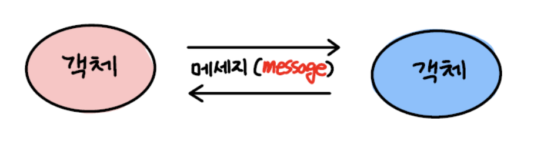

# 01. 협력하는 객체들의 공동체


객체지향이란 실세계를 직접적이고 직관적으로 모델링 할 수 있는 패러다임

객체지향 소프트웨어는 실세계의 투영이며, 객체란 현실 세계에 존재하는 사물에 대한 추상화

**그러나 실세계를 모방하는 것과 객체지향 프로그래밍은 차이가 있다.**

객체지향은 실세계를 모방하는 것이 아닌 새로운 세계를 창조하는 것!


1. 소프트웨어 객체의 자율성 : 상태와 행위를 캡슐화
2. 객체의 협력 : 객체끼리의 협력이 가능한 수단은 메세지
3. 연결 완결성 : 실세계 사물을 기반으로 소프트웨어 객체를 식별한 후 구현으로 이어간다.

```
상태 = 변수
행위 = 메서드
```

</img>


<br>

## 협력하는 사람들   


|역할|책임|
|:---|:---|
|손님|커피 주문| 
|캐시어|주문 받기|
|바리스타|커피 제조|


<br>

## 요청과 응답으로 구성된 협력

요청(Request) : 문제를 알고 있거나 해결할 수 있는 사람에게 도움을 요청
응답(Response) : 요청에 주어진 책임을 다하여 지식이나 서비스를 제공하는 것

**요청과 응답을 통해 다른 사람과 협력(collaboration) 할 수 있다.**

<br>

## 역할과 책임
사람들은 다른 사람과 협력하는 과정 속에서 특정한 역할(role)을 부여받는다.   
역할은 책임(Responsibility)라는 개념을 내포하고 있다.

예시) 마피아 게임   
마피아 - 사람을 죽여야함   
시민 - 마피아를 밝혀내야함   
의사 - 마피아가 지목한 사람을 살릴 수 있음   


**특정한 역할은 특정한 책임을 암시한다**

<br>

사람들이 협력을 위해 특정한 역할을 맡고 역할에 적합한 책임을 수행한다는 사실은 몇가지 중요한 개념을 제시한다.
* 여러 사람이 동일한 역할을 수행할 수 있다 : 캐시어의 책임을 충분히 할 수 있는 사람이면 누가 되어도 상관이 없다.
* 역할은 대체 가능성을 의미한다 : 캐시어의 책임을 여러명이 가능하다면 손님 입장에서는 누가 주문을 받더라도 상관 없다. **대체가능성**
* 책임을 수행하는 방법은 자율적으로 선택할 수 있다. : 책임을 수행하는 방법은 정해져 있지 않고 다양하게 처리할 수 있다. **다형성(polymorphis)**
* 한 사람이 동시에 여러 역할을 수행할 수 있다. : 캐시어가 주문을 받으면서 커피를 만드는 역할도 수행 할 수 있다.


<br>

# 역할, 책임, 협력

## 기능을 구현하기 위해 협력하는 객체들

사람 - 객체   
요청 - 메세지   
처리하는 방법 - 메서드

<br>

## 역할과 책임을 수행하며 협력하는 객체들

```
켄트 벡(Kent Beck) - "어떤 객체도 섬이 아니다"
```

켄트 벡의 말처럼 객체는 역할과 책임을 다하며 서로 협력한다.

객체지향 설계는 적절한 객체에게 적절한 책임을 할당하는 것이다. 책임은 객체지향 설계의 품질을 결정하는 가장 중요한 요소이다.

<br>

## 역할의 특징

 * 여러 객체가 동일한 역할을 수행할 수 있다.
 * 역할은 대체 가능성을 의미한다.
 * 각 객체는 책임을 수행하는 방법을 자율적으로 선택할 수 있다.
 * 하나의 객체가 동시에 여러 역할을 수행할 수 있다.

역할은 유연하고 재사용 가능한 협력 관계를 구축하는 데 중요한 설계 요소이다.


<br>

## 협력 속에 사는 객체

협력의 참여하는 주체는 객체

객체는 어플리케이션의 기능을 구현하기 위해 존재한다.

객체지향의 아름다움 = 협력   
협력의 조화 = 객체의 품질이 좋다.

<br>

## 객체지향의 두가지 덕목
1. 객체는 충분히 '협력적'이어야 한다.   
* 다른 객체에서 오는 요청 귀 기울이며 적극적으로 도와주어야 한다.
* god object(모든 것을 혼자 처리하는 객체)는 자멸하고 만다.
* 응답 방식, 여부: 객체가 결정

2. 객체는 '자율적'이어야 한다.
* 자신의 원칙에 따라 일을 하거나 스스로 통제하여 절제하는 것
* 요청에 대해 스스로 판단하고 결정한다.
* ex) 손님이 캐시어가 바리스타한테 주문을 넘길 때에 대해서 관여하지 않음


<br>

## 상태와 행동을 함께 지닌 자율적인 객체
객체를 상태(state)와 행동(behavior)을 함께 지닌 실체라고 정의한다.

객체가 협력에 참여하기 위해 어떤 행동을 해야 한다면 그 행동을 하는 데 필요한 상태도 함께 지니고 있어야 한다.

객체의 내부와 외부를 구분해야 한다.   
* 객체는 다른 객체가 무엇(what)을 수행하는지는 알 수 없지만 어떻게(how) 수행하는지에 대해서는 알 수 없다.


과거 전통적인 개발 방법은 데이터와 프로세스를 구분하였지만 객체지향은 하나의 틀 안에 함께 묶어 놓음으로써 자율성을 보장한다.


<br>

## 협력과 메세지
메세지 = 객체들의 유일한 소통수단   
송신자 : sender   
수신자 : receiver

<br>

## 메서드의 자율성
메서드 = 객체가 메세지를 처리하는 방법
```java
바리스타.커피제조() // 메세지

/*메서드*/
public void 커피제조() { 
    message에 알맞는 행동
}
```
캐시어는 커피가 제조될 것이라 기대하지만 커피에 대해서 어떻게 제조하는지는 알 수 없음


<br>

# 객체지향의 본질

## 객체지향이랑 무엇인가?
* 객체 지향 : 시스템을 상호작용하는 **자율적인 객체들의 공동체**로 바라보고 객체를 이용해 시스템을 분별하는 방법
* 자율적인 객체 : **상태**와 **행위**를 함께 지니며 스스로 자기 자신을 책임지는 객체
* 객체는 시스템의 행위를 구현하기 위해 다른 객체와 협력한다.
각 객체는 협력 내에서 정해진 **역할**을 수행하며 역할은 관련된 **책임**의 집합이다
* 객체는 다른 객체와 협력하기 위해 메시지를 전송하고 **메시지**를 수신한 객체는 메시지를 처리하는데 적합한 **메서드**를 자율적으로 선택한다

<br>

## 객체를 지향하라
코드를 담는 클래스의 관점에서 메시지를 주고 받는 객체의 관점으로 사고의 중심을 전환해야 한다.

클래스의 구조와 메서드가 아니라 객체의 역할, 책임, 협력에 집중하라. 객체지향을 객체를 지향하는 것이지 클래스를 지향하는 것이 아니다.

javascript는 클래스가 아니지만 객체지향 언어이다.


<br>

# 느낀점
이번 장은 객체는 각자 스스로 자율성이 있고 협력하는 존재라는 것을 강조한 것 같다. 나도 class를 선언하고 거기에 method를 호출 할 때 내가 선택해서 호출한다고 생각했지 그 class 요청이라는 생각을 못했던 것 같다.   
객체를 만들 때 그 역할에 대해서 생각하며 선언을 하도록 해야겠다. 단순히 정해진 개발 포멧에 맞춰 하는 것이 아닌 그 역할에 해당되는 책임을 생각하여 클래스들을 만들어 보도록 해야겠다.